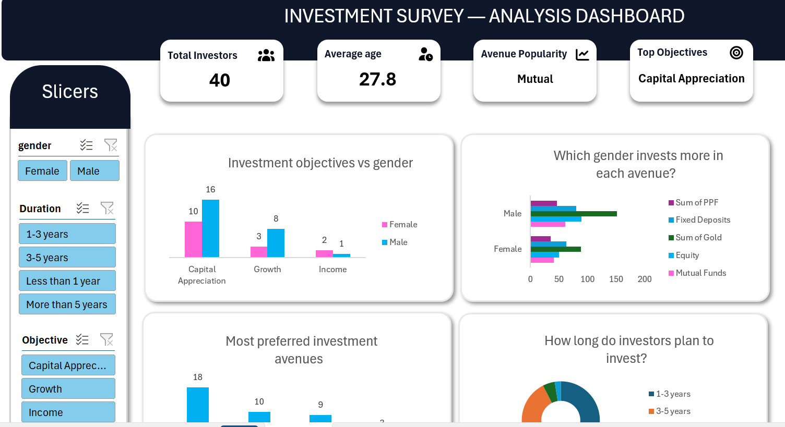

# 📊 Investment Survey Analysis Dashboard (Microsoft Excel)

An interactive **Investment Survey Analysis Dashboard** built in **Microsoft Excel** to analyze investor preferences, financial objectives, and investment behavior. The dashboard transforms raw survey data into meaningful insights using Pivot Tables, Pivot Charts, KPI Cards, and Slicers.

---

## 📷 Dashboard Preview



---

## 📌 Project Overview

This project analyzes an investment survey dataset to understand investor demographics, preferred investment avenues, financial goals, expected returns, and investment habits.

The dashboard is fully interactive and enables users to filter insights using slicers for a more dynamic analysis experience.

---

## 🎯 Objectives

- Analyze investor demographics
- Identify the most preferred investment avenues
- Understand investment objectives
- Compare investment behavior by gender
- Explore expected returns and investment duration
- Discover factors influencing investment decisions
- Build a professional and interactive Excel dashboard

---

## 📈 Dashboard KPIs

- 👥 Total Investors
- 📊 Average Age
- 💹 Top Investment Avenue
- 🎯 Top Investment Objective

---

## 📊 Dashboard Insights

- Investment Objectives by Gender
- Investment Preferences by Gender
- Most Preferred Investment Avenues
- Investment Duration
- Savings Objectives
- Investment Decision Factors
- Expected Returns by Gender
- Portfolio Monitoring Frequency

---

## 🛠 Tools & Techniques

- Microsoft Excel
- Pivot Tables
- Pivot Charts
- Slicers
- KPI Cards
- Conditional Formatting
- Data Cleaning
- Dashboard Design
- Data Visualization

---

## 📂 Repository Structure

```
Investment-Survey-Dashboard/
│
├── Dataset/
│   └── Investment_Survey.csv
│
├── Excel Dashboard/
│   └── Investment Survey Dashboard.xlsx
│
├── images/
│   └── dashboard.png
│
└── README.md
```

---

## 🚀 Key Takeaways

- Built a fully interactive dashboard using Excel.
- Created KPI cards for quick executive insights.
- Used slicers to improve user interaction.
- Applied business-focused data visualization techniques.
- Practiced transforming raw survey data into actionable insights.

---

## 📬 Connect With Me

**Syed Sami Ullah**

- LinkedIn: https://www.linkedin.com/in/syed-sami-ullah-9232602a6
- GitHub: https://github.com/SyedSamiUllah1

---

⭐ If you found this project helpful, consider giving it a star!
